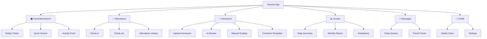
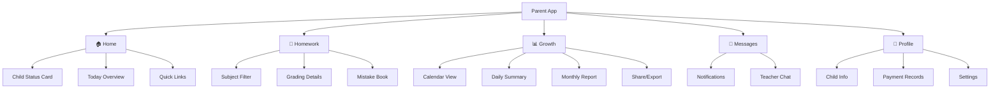
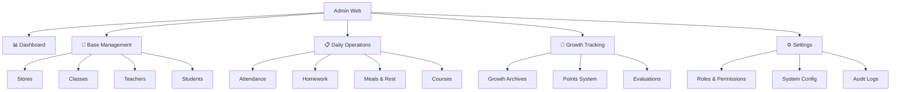
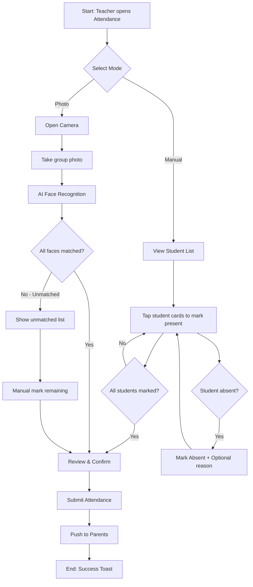
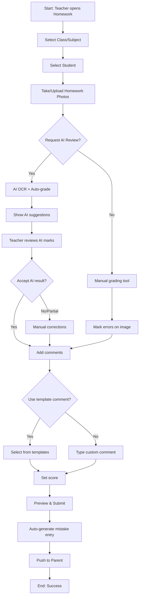
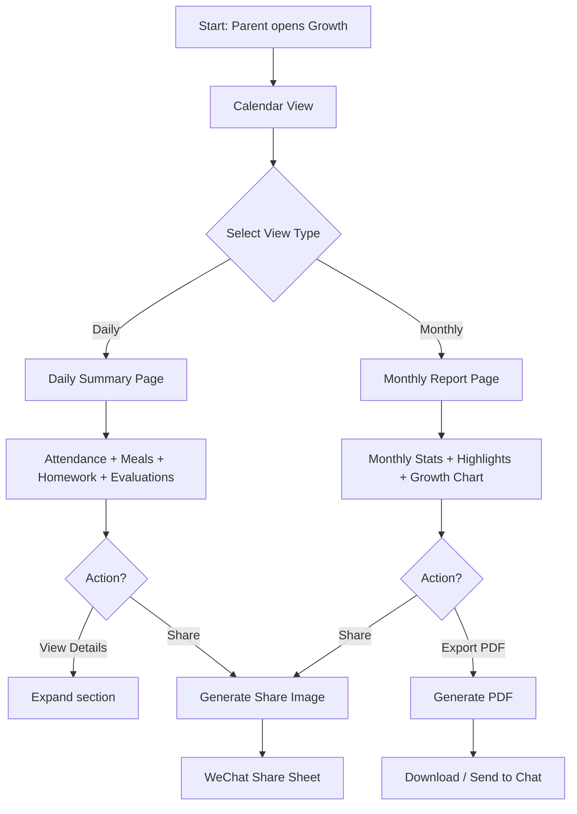

# cc-ai-center UI/UX Specification

**Version:** 1.0
**Date:** 2026-01-09
**Author:** UX Expert Agent (Jingwen)

---

## 1. Introduction

This document defines the user experience goals, information architecture, user flows, and visual design specifications for cc-ai-center's user interface. It serves as the foundation for visual design and frontend development, ensuring a cohesive and user-centered experience.

### 1.1 Overall UX Goals & Principles

#### 1.1.1 Target User Personas

| Persona | Description | Primary Needs | Pain Points |
|---------|-------------|---------------|-------------|
| **Teacher (教师)** | After-school care staff managing 15-30 students daily | Quick attendance, efficient homework grading, easy communication | Repetitive tasks, manual record-keeping, parent communication overload |
| **Parent (家长)** | Busy working parents with children in after-school care | Real-time child status, growth visibility, transparent communication | Information anxiety, lack of insight into child's daily activities |
| **Institution Admin (机构管理员)** | Operations managers of care centers | Data-driven decisions, operational efficiency, compliance | Scattered data, manual reporting, scaling challenges |
| **Government Regulator (政府监管员)** | Education bureau officials overseeing care institutions | Compliance monitoring, safety oversight, data accessibility | Limited visibility, manual audits, inconsistent reporting |

#### 1.1.2 Usability Goals

1. **Zero learning curve**: New teachers complete core tasks within 5 minutes
2. **3-tap rule**: 90% of high-frequency operations (attendance, homework upload) ≤ 3 taps
3. **Real-time sync**: Parent sees teacher's update within 2 seconds
4. **Clarity over speed**: Error prevention via clear validation and confirmations
5. **Offline resilience**: Core functions (attendance marking) work offline with sync

#### 1.1.3 Design Principles

1. **Clarity over cleverness** - Prioritize clear communication over aesthetic innovation
2. **Task-driven design** - Teacher sees pending tasks with badge counts; Parent sees child status first
3. **Progressive disclosure** - Show only what's needed, hide advanced options behind expandable sections
4. **Consistent patterns** - Same interaction patterns across all 4 platforms
5. **Immediate feedback** - Every action has clear, immediate visual/haptic response

### 1.2 Change Log

| Date | Version | Description | Author |
|------|---------|-------------|--------|
| 2026-01-09 | 1.0 | Initial UI/UX Specification | UX Expert Agent (Jingwen) |

---

## 2. Information Architecture (IA)

### 2.1 Site Map / Screen Inventory

#### 2.1.1 Teacher Mini Program (教师端)



#### 2.1.2 Parent Mini Program (家长端)



#### 2.1.3 Institution Admin Web (机构管理后台)



### 2.2 Navigation Structure

| Platform | Primary Nav | Secondary Nav | Breadcrumb |
|----------|-------------|---------------|------------|
| **Teacher Mini** | Bottom tab bar (5 items): Home, Attendance, Homework, Growth, Profile | Top segmented controls within each tab | Not applicable (flat hierarchy) |
| **Parent Mini** | Bottom tab bar (5 items): Home, Homework, Growth, Messages, Profile | Top filters (subject, date range) | Not applicable |
| **Admin Web** | Left sidebar (collapsible): Dashboard, Base Mgmt, Operations, Growth, Settings | Sub-menu expansion + top breadcrumb | Full path: Dashboard > Base Mgmt > Students > [Name] |
| **Gov Web** | Left sidebar: Dashboard, Institutions, Audits, Reports | Tabbed views within sections | Full path breadcrumb |

### 2.3 Navigation Design Decisions

| Decision | Choice | Rationale |
|----------|--------|-----------|
| **Mini Program: 5-tab limit** | 5 tabs (WeChat guideline) | WeChat recommends max 5 tabs; aligns with PRD's core pages |
| **Teacher Home as task hub** | Badge-driven workbench | PRD 3.3: "待办数字徽章醒目，快捷操作4宫格" |
| **Parent Home: Status first** | Child status card at top | PRD 3.1: "孩子状态首屏可见" addresses parent anxiety |
| **Admin: Collapsible sidebar** | Left nav, 1920px optimized | PRD 3.6: "Web端以1920x1080为主设计分辨率" |
| **No hamburger menus** | Direct tab/sidebar access | High-frequency tasks need ≤3 taps per PRD 3.2 |

---

## 3. User Flows

### 3.1 Teacher Attendance Check-in (签到点名)

**User Goal:** Mark students as checked-in quickly and accurately

**Entry Points:** Home quick action, Attendance tab, Push notification reminder

**Success Criteria:** All present students marked within 2 minutes; Parents notified instantly



#### Edge Cases & Error Handling

| Scenario | Handling |
|----------|----------|
| Camera permission denied | Show permission guide, fallback to manual mode |
| Face recognition fails | Allow manual override, log for review |
| Network offline | Queue locally, sync when online, show pending indicator |
| Late arrival after check-in closed | "Late check-in" mode with timestamp |
| Duplicate check-in attempt | Show "Already checked in at [time]" |

### 3.2 Teacher Homework Upload & AI Grading (作业批改)

**User Goal:** Upload homework photos, get AI assistance, provide feedback to parents

**Entry Points:** Home quick action, Homework tab, Student profile

**Success Criteria:** Homework graded with score and comments; Parent can view within 5 seconds of submission



#### Edge Cases & Error Handling

| Scenario | Handling |
|----------|----------|
| Image too blurry for AI | Prompt retake, allow manual grading |
| AI confidence low (<70%) | Highlight uncertain areas for teacher review |
| Large file upload fails | Compress automatically, retry with progress |
| Wrong student selected | Allow reassignment before submission |
| Duplicate homework entry | Warn "Homework already submitted today" |

### 3.3 Parent Views Child Status (家长查看孩子状态)

**User Goal:** Quickly understand child's current status and today's activities

**Entry Points:** App launch (Home is default), Push notification tap

**Success Criteria:** Child's current status visible within 1 second of app open

```mermaid
graph TD
    A[Start: Parent opens App] --> B[Home Screen]
    B --> C[Status Card: Current State]

    C --> D{Child Status}
    D -->|Not Yet Arrived| E[Show: Expected arrival time]
    D -->|Checked In| F[Show: Check-in time + photo]
    D -->|In Class| G[Show: Current activity]
    D -->|Checked Out| H[Show: Pickup time + by whom]

    B --> I[Today's Overview Cards]
    I --> J[Attendance Summary]
    I --> K[Homework Status]
    I --> L[Meals & Rest]
    I --> M[Teacher Comments]

    J --> N{Tap for details}
    K --> N
    L --> N
    M --> N

    N --> O[Navigate to detail page]
```



#### Edge Cases & Error Handling

| Scenario | Handling |
|----------|----------|
| No data yet today | Show "Waiting for today's first update" |
| Multiple children | Child switcher at top, remember last viewed |
| Push notification for other child | Auto-switch to relevant child |
| Stale data (network issue) | Show last sync time, pull-to-refresh |

### 3.4 Parent Views Growth Archive (成长档案查看)

**User Goal:** Review child's growth over time, share achievements with family

**Entry Points:** Growth tab, Home "Monthly Report" card, Push notification

**Success Criteria:** Can navigate to any date's summary; Can share/export within 3 taps



#### Edge Cases & Error Handling

| Scenario | Handling |
|----------|----------|
| No data for selected date | "No records for this date" with nearest date suggestion |
| PDF generation slow | Show progress, allow background generation |
| Share image too large | Auto-compress, maintain readability |
| Historical data gaps | Show available dates highlighted on calendar |

---

## 4. Wireframes & Mockups

### 4.1 Design Files

**Primary Design Files:** To be created in Figma

**Recommended Figma Structure:**
- Project: cc-ai-center
  - File: Teacher Mini Program
  - File: Parent Mini Program
  - File: Admin Web
  - File: Government Web
  - File: Component Library

### 4.2 Key Screen Layouts

#### 4.2.1 Teacher Mini Program

| Screen | Purpose | Key Elements | Interaction Notes |
|--------|---------|--------------|-------------------|
| **Home/Workbench** | Task-driven daily hub | Badge counters (3), Quick action grid (4), Activity feed | Badges tap → relevant section |
| **Attendance** | Student check-in/out | Mode toggle, Student card grid, Batch confirm button | Long-press → mark absent with reason |
| **Homework Grading** | Upload & grade | Photo capture area, AI suggestion panel, Annotation toolbar, Comment templates | Pinch-zoom on image, swipe between students |
| **Growth Record** | Daily summary editing | Auto-populated sections, Edit icons, Preview button | Inline editing, auto-save |

#### 4.2.2 Parent Mini Program

| Screen | Purpose | Key Elements | Interaction Notes |
|--------|---------|--------------|-------------------|
| **Home** | Child status at-a-glance | Status card (prominent), Today's 3-stat row, Activity timeline | Pull-to-refresh, tap card → details |
| **Homework** | Review graded work | Subject tabs, Homework cards with scores, Mistake book entry | Filter by subject/date, tap → full view |
| **Growth Archive** | Historical view | Calendar (dot indicators), Daily/Monthly toggle, Share FAB | Swipe calendar, tap date → summary |

#### 4.2.3 Admin Web

| Screen | Purpose | Key Elements | Interaction Notes |
|--------|---------|--------------|-------------------|
| **Dashboard** | KPI overview | 4 metric cards, Trend charts, Alert list | Cards clickable → drill-down |
| **Student List** | CRUD management | Filter bar, Data table, Batch actions, Detail drawer | Row click → side drawer, bulk select |
| **Attendance View** | Daily/historical records | Date picker, Class filter, Status heatmap, Export button | Cell click → student detail |

---

## 5. Component Library / Design System

### 5.1 Design System Approach

**Approach:** Hybrid - Extend existing systems per platform

| Platform | Base System | Customization |
|----------|-------------|---------------|
| WeChat Mini Programs | WeUI (official WeChat components) | Brand colors, custom icons, extended components |
| Web Admin | Ant Design 5.x | Theme tokens override, custom dashboard components |

### 5.2 Core Components

| Component | Purpose | Variants | States |
|-----------|---------|----------|--------|
| **StudentCard** | Display student in lists | Compact, Expanded, Selectable | Default, Selected, Absent, Alert (allergy) |
| **StatusBadge** | Show attendance/task status | Checked-in, Absent, Late, Pending | Active, Inactive |
| **MetricCard** | Dashboard KPI display | Number, Trend, Comparison | Normal, Warning, Critical |
| **TimelineItem** | Activity feed entries | Attendance, Homework, Evaluation, System | Read, Unread |
| **ActionButton** | Primary actions | Primary, Secondary, Danger, Ghost | Default, Loading, Disabled |
| **PhotoCapture** | Image upload with preview | Single, Multi, Camera-only | Empty, Uploading, Complete, Error |
| **CommentInput** | Teacher feedback entry | Plain, With-templates, Voice | Empty, Typing, Has-content |
| **GrowthChart** | Visualize progress | Line, Bar, Radar | Loading, Has-data, Empty |

### 5.3 Component Specifications

#### StudentCard

```
Purpose: Display student information in lists and grids

Props:
- student: StudentData (required)
- variant: 'compact' | 'expanded' | 'selectable' (default: 'compact')
- selected: boolean (default: false)
- onSelect: (student) => void
- onLongPress: (student) => void

States:
- Default: Normal display
- Selected: Blue border, checkmark overlay
- Absent: Grayed out, absent badge
- Alert: Orange border, allergy/medical icon

Usage:
- Attendance list: selectable variant
- Student search results: compact variant
- Student detail header: expanded variant
```

#### StatusBadge

```
Purpose: Visual indicator of status

Props:
- status: 'checked-in' | 'absent' | 'late' | 'pending' | 'checked-out'
- size: 'small' | 'medium' | 'large' (default: 'medium')
- showLabel: boolean (default: true)

Colors:
- checked-in: #52C41A (Success Green)
- absent: #FF4D4F (Error Red)
- late: #FAAD14 (Warning Yellow)
- pending: #999999 (Gray)
- checked-out: #1890FF (Primary Blue)
```

---

## 6. Branding & Style Guide

### 6.1 Visual Identity

**Brand Concept:** 简洁、专业、亲和 (Simple, Professional, Approachable)

**Brand Personality:**
- Trustworthy and reliable
- Warm and caring
- Modern and efficient
- Professional yet friendly

### 6.2 Color Palette

| Color Type | Hex Code | RGB | Usage |
|------------|----------|-----|-------|
| **Primary (Trust Blue)** | #1890FF | 24, 144, 255 | Primary buttons, navigation bar, links |
| **Secondary (Vitality Orange)** | #FF7A45 | 255, 122, 69 | Notifications, points, activity highlights |
| **Success (Green)** | #52C41A | 82, 196, 26 | Check-in success, correct marks, positive feedback |
| **Warning (Yellow)** | #FAAD14 | 250, 173, 20 | Cautions, pending items, attention needed |
| **Error (Red)** | #FF4D4F | 255, 77, 79 | Errors, wrong answers, absent status, destructive actions |
| **Text Primary** | #333333 | 51, 51, 51 | Body text, headings |
| **Text Secondary** | #666666 | 102, 102, 102 | Secondary text, labels |
| **Text Placeholder** | #999999 | 153, 153, 153 | Placeholder text, disabled |
| **Border** | #E8E8E8 | 232, 232, 232 | Dividers, card borders |
| **Background** | #F5F5F5 | 245, 245, 245 | Page background |
| **Card Background** | #FFFFFF | 255, 255, 255 | Card surfaces |

### 6.3 Typography

#### Font Families

- **Primary:** PingFang SC (iOS), Microsoft YaHei (Android/Windows), system-ui fallback
- **Monospace:** SF Mono, Menlo, monospace (for codes, numbers)

#### Type Scale

| Element | Size | Weight | Line Height | Usage |
|---------|------|--------|-------------|-------|
| H1 | 24px | 600 | 1.4 | Page titles |
| H2 | 20px | 600 | 1.4 | Section headers |
| H3 | 17px | 500 | 1.4 | Card titles |
| Body | 14px | 400 | 1.6 | Body text |
| Small | 12px | 400 | 1.5 | Captions, timestamps |
| Mini | 10px | 400 | 1.4 | Badges, tags |

### 6.4 Iconography

**Icon Library:** Custom icon set based on linear style

**Style Guidelines:**
- Stroke weight: 2px
- Cap style: Rounded
- Corner style: Rounded
- Optical alignment: Centered in bounding box

**Icon Sizes:**
| Size | Pixels | Usage |
|------|--------|-------|
| Inline | 16px | Within text, small indicators |
| Navigation | 24px | Tab bar, action buttons |
| Feature | 32px | Feature icons, list items |
| Empty State | 48px | Empty states, onboarding |

### 6.5 Spacing & Layout

#### Grid System

**Mini Program:**
- Base width: 375px
- Base unit: 8px
- Use rpx units for automatic scaling

**Web:**
- Columns: 12
- Gutter: 24px
- Max content width: 1440px

#### Spacing Scale

| Token | Value | Usage |
|-------|-------|-------|
| xs | 4px | Inline spacing, tight groups |
| sm | 8px | Related element spacing |
| md | 16px | Component internal padding |
| lg | 24px | Section spacing |
| xl | 32px | Page section gaps |
| xxl | 48px | Major section divisions |

---

## 7. Accessibility Requirements

### 7.1 Compliance Target

**Standard:** WCAG 2.1 AA

### 7.2 Visual Requirements

| Requirement | Specification | Implementation |
|-------------|---------------|----------------|
| Color contrast | ≥ 4.5:1 for normal text, ≥ 3:1 for large text | All color combinations tested |
| Focus indicators | 2px solid outline, 2px offset | Visible on all interactive elements |
| Text sizing | Min 14px body, supports system font scaling | Use relative units (rem) |
| Color independence | Never use color alone to convey info | Add icons, text labels, patterns |

### 7.3 Interaction Requirements

| Requirement | Specification | Implementation |
|-------------|---------------|----------------|
| Touch targets | Minimum 44x44px | All buttons, links, inputs |
| Keyboard navigation | Full tab navigation on Web | Logical tab order, skip links |
| Screen reader | ARIA labels on all controls | Semantic HTML, role attributes |
| Reduced motion | Respect prefers-reduced-motion | Disable animations when set |

### 7.4 Content Requirements

| Requirement | Specification | Implementation |
|-------------|---------------|----------------|
| Alt text | All images have descriptive alt | Including student photos, homework images |
| Heading structure | Logical H1→H2→H3 hierarchy | One H1 per page |
| Form labels | All inputs have visible labels | Associated via `for`/`id` or aria-labelledby |
| Error messages | Clear, specific, actionable | Announce via aria-live regions |

### 7.5 Testing Strategy

1. **Automated:** axe-core integration in CI/CD for Web
2. **Manual:** Screen reader testing (VoiceOver iOS, TalkBack Android, NVDA Windows)
3. **User testing:** Include users with disabilities in beta testing

---

## 8. Responsiveness Strategy

### 8.1 Breakpoints

| Breakpoint | Min Width | Max Width | Target Devices | Layout Behavior |
|------------|-----------|-----------|----------------|-----------------|
| **Mobile** | 320px | 767px | Phones, Mini Programs | Single column, bottom nav |
| **Tablet** | 768px | 1023px | iPads, small laptops | 2-column where appropriate |
| **Desktop** | 1024px | 1439px | Standard monitors | Full sidebar + content |
| **Wide** | 1440px | - | Large monitors, 4K | Max-width container, increased whitespace |

### 8.2 Mini Program Specific

- Design at 375px × 667px (iPhone 8 equivalent)
- Use rpx units (responsive px) for automatic scaling
- Bottom safe area for iPhone X+ notch devices
- Support WeChat 8.0+

### 8.3 Adaptation Patterns

| Aspect | Mobile/Mini Program | Tablet | Desktop |
|--------|---------------------|--------|---------|
| **Navigation** | Bottom tab bar (5 items) | Bottom tabs or side rail | Collapsible left sidebar |
| **Layout** | Single column, full-width cards | 2-column grid | Sidebar + main + optional detail panel |
| **Tables** | Card list view, horizontal scroll | Responsive table with priority columns | Full table with all columns |
| **Modals** | Full-screen sheets | Centered modal (60% width) | Centered modal (40% width) or side drawer |
| **Touch/Click** | 44px min targets, swipe gestures | Touch + hover states | Hover states, smaller click targets OK |

---

## 9. Animation & Micro-interactions

### 9.1 Motion Principles

1. **Purposeful:** Animation guides attention, confirms actions, shows relationships
2. **Quick:** Most transitions 200-300ms; never block user progress
3. **Natural:** Ease-out for entering, ease-in for exiting, spring for playful elements
4. **Consistent:** Same animation for same action type across app
5. **Respectful:** Honor prefers-reduced-motion setting

### 9.2 Key Animations

| Animation | Context | Duration | Easing | Description |
|-----------|---------|----------|--------|-------------|
| **Page transition** | Navigation | 300ms | ease-out | Slide left/right for push/pop |
| **Card press** | Tap feedback | 100ms | ease-out | Scale to 0.98, subtle shadow |
| **Success checkmark** | Attendance confirm | 400ms | spring | Check draws in, slight bounce |
| **Badge pulse** | New notification | 600ms | ease-in-out | Scale 1→1.2→1, repeats 2x |
| **Loading spinner** | Data fetch | continuous | linear | Rotate 360°, 1s per rotation |
| **Pull-to-refresh** | List refresh | 200ms | ease-out | Pull down reveals loader |
| **Toast appear** | System message | 200ms | ease-out | Fade + slide up from bottom |
| **Modal overlay** | Dialog open | 250ms | ease-out | Fade in backdrop, scale up content |
| **List item add** | New item | 300ms | ease-out | Fade + slide down |
| **Skeleton shimmer** | Loading state | continuous | linear | Gradient sweep left→right |

### 9.3 Animation Tokens

```css
/* Timing */
--duration-instant: 100ms;
--duration-fast: 200ms;
--duration-normal: 300ms;
--duration-slow: 400ms;

/* Easing */
--ease-out: cubic-bezier(0.0, 0.0, 0.2, 1);
--ease-in: cubic-bezier(0.4, 0.0, 1, 1);
--ease-in-out: cubic-bezier(0.4, 0.0, 0.2, 1);
--ease-spring: cubic-bezier(0.175, 0.885, 0.32, 1.275);
```

---

## 10. Performance Considerations

### 10.1 Performance Goals

| Metric | Target | Measurement |
|--------|--------|-------------|
| **First Contentful Paint (FCP)** | < 1.5s | Lighthouse, real user monitoring |
| **Largest Contentful Paint (LCP)** | < 2.5s | Core Web Vital target |
| **Time to Interactive (TTI)** | < 3.5s | User can interact with main features |
| **Interaction Response** | < 100ms | Button press to visual feedback |
| **Animation FPS** | 60fps | Smooth animations, no jank |
| **Mini Program Package** | < 2MB main | WeChat requirement for fast launch |

### 10.2 Design Strategies for Performance

1. **Skeleton screens:** Show layout placeholders immediately, fill in data as loaded
2. **Progressive image loading:** Thumbnails first, full resolution on demand
3. **Lazy loading:** Load below-fold content and secondary screens on demand
4. **Optimized images:** WebP format, responsive srcset, max 200KB per image
5. **Icon sprites/fonts:** Single icon font or SVG sprite vs individual files
6. **Minimal animations:** Use CSS transforms/opacity only (GPU accelerated)
7. **Virtual scrolling:** For long student lists (>50 items)
8. **Offline-first:** Cache critical data, show cached content immediately

---

## 11. Next Steps

### 11.1 Immediate Actions

1. **Create Figma project** with component library and page frames
2. **Design Teacher Mini Program** priority screens: Home, Attendance, Homework
3. **Design Parent Mini Program** priority screens: Home, Growth Archive
4. **Design Admin Web** priority screens: Dashboard, Student Management
5. **Conduct stakeholder review** of wireframes before high-fidelity
6. **Define interaction prototypes** for key flows (attendance, homework grading)

### 11.2 Design Handoff Checklist

| Item | Status | Notes |
|------|--------|-------|
| All user flows documented | ✅ Complete | 4 core flows defined |
| Component inventory complete | ✅ Complete | 8 core components specified |
| Accessibility requirements defined | ✅ Complete | WCAG AA compliance |
| Responsive strategy clear | ✅ Complete | 4 breakpoints + mini program |
| Brand guidelines incorporated | ✅ Complete | Colors, typography, spacing |
| Performance goals established | ✅ Complete | Core Web Vitals targets |

### 11.3 Handoff to Development

**For Frontend Development:**
- Use this document alongside Figma designs for implementation
- Follow component specifications for consistent behavior
- Implement accessibility requirements from the start
- Test against performance goals during development

**For Backend/API:**
- User flows indicate data requirements and timing expectations
- Real-time sync requirement (< 2 seconds) impacts API design
- Offline support requires optimistic updates and sync strategy

---

## 12. Appendix

### 12.1 Reference Documents

- PRD: `docs/prd.md`
- Architecture: `docs/architecture.md` (to be created)
- API Specification: `docs/api-spec.md` (to be created)

### 12.2 Design System Resources

- WeUI Documentation: https://weui.io/
- Ant Design: https://ant.design/
- WeChat Mini Program Design Guidelines: https://developers.weixin.qq.com/miniprogram/design/

---

*Generated by Orchestrix UX Expert Agent - Jingwen*
*Version 1.0 | 2026-01-09*
